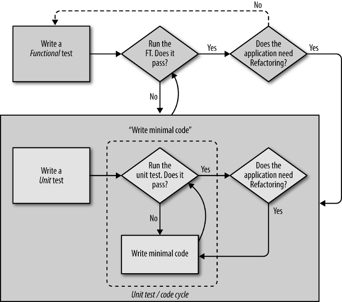
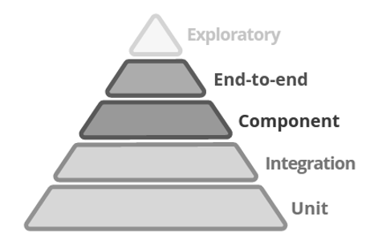
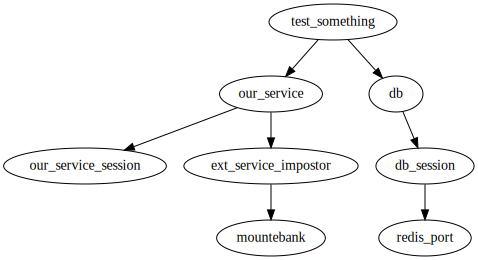

# TDD of Python microservices - Michał Bultrowicz

## Abstract (OK)
To have a successful microservice-based project you might want to start testing early on,
shorten the engineering cycles, and provide a more sane workplace for the developers.
Test-driven development (TDD) allows you to have that.

Except for the stalwart unit tests, proper TDD also requires functional tests.
This article shows how to implement those tests (using the
[Mountepy] (https://github.com/butla/mountepy) library I made, Pytest and Docker),
how to enforce TDD (using multi-process code coverage) and good code style (with automated
Pylint checks) within a team.

Furthermore, contract tests based on Swagger interface definitions are introduced as a safeguard
of the microservices' interoperability.

The focus is on services communicating through HTTP, but some general principles will also apply to
all web or network services.


## Service tests
### Their place in TDD (OK)
To have TDD and thus a maintainable microservice project we need tests that can validate
the entirety of a single application - the "service tests".
This term is used in "Building Microservices", but Harry Percival calls them (although in the
context of traditional, monolithic web applications) "functional tests" in
"Test-Driven Development with Python".
Those functional tests are essential for implementing the "real TDD", that is the "double loop"
or "outside-in" TDD (shown on diagram below).



This image (taken from Percival's book) succintly explains the test-driven development process.

Adding each new application feature should start with a functional (service) test.
This kind of verification is necessary to check if units of code work together as planned.
It's important to remember that as service tests take longer to run and are more complex
than unit tests, they should only be used to cover a few critital code paths.
Full validation of the application's logic (code coverage) should be achieved with unit tests
(but as shown later on, unit tests don't have to duplicate the same cases that are 
covered by service tests).

### Their place in microservice tests (OK)
Service tests are the thing that says whether an application will not just crash on start
after you deploy it.
They can do that because they examine a "living" and "authentic" process of an application.
Authenticity in this case means running the process like it would run in a production
environment, with no special test flags, no fake data base clients, etc.
The application under test should "have no idea" that it's not in a "real" environment.

With these properties, a test suite can run locally, in isolation from the production (or staging)
environment.
It can be launched on a development or a CI (Continuous Integration) machine.
This allows for parallel development of multiple microservices by multiple teams

In his presentation about testing microservices, Martin Fowler places service tests
(which he calls out-of-process component tests) in the middle of the tests pyramid.



The general idea is that the higher you get in the pyramid, the tests:

* become more complex and hard to maintain,
* have greater response time (run longer),
* should be fewer.

All of those kinds of tests are important for a microservice-based system, but due to limited
space I can't get into detail about all of them.
Anyhow, if all services have a good suit of unit and service tests, then each should behave
like we wanted it to, so there's a good chance that the whole system will work fine...
But in reality we still need end-to-end tests to check for unexpected errors that sometimes
happen (so they surely will eventually happen) when integrating the entire platform in a
production-like (or the actual production) environment.

Nevertheless, even inroducing TDD with unit and service tests alone will greatly improve
your development process, so let's move on.

### Necessary tools
To have local service tests, the service's runtime dependencies must somehow be satisfied.
Assuming we're building HTTP microservices, the dependencies most probably are:

* data bases
* other microservices (or any other HTTP applications)

Data bases can be handled a few ways in tests:

* Naively - just by installing on the machine running the tests.
  This is tiresome and unwieldy.
  Development of every microservice would either require a large manual setup or installation
  scripts that can require a lot of work to maintain.
  Also if someone works on a few projects they'll get a lot of clutter on their OS.
* with Verified Fakes - rarely seen. Wymagają jakiegoś przygotowania. Co to?
* **with Docker** - just create everything you need as containers. A while ago only for linux, but
  now support is starting on windowns and Mac.

O ile bazy dla jednej aplikacji dałoby się wystawić, to pozostałe
serwisy ciągną za sobą ich zależności, aż w końcu trzeba by wystawiać całą platformę na
jednej maszynie, co nie dość, że nieporęczne, to często niemożliwe.
But HTTP services can be mocked (or stubbed) out for service tests.
There are a few solutions, the ones I came across with:

* WireMock - odpalane jako niezależny proces. Wychodzi z Javy. Może być konfigurowany po HTTP
* Pretenders (Python) - można używać jako biblioteki z kodu testów. Nie wydaje się mocno rozwijany.
* Mountebank - tak jak WireMock, ale więcej funkcjonalności (testy TCP, popsutych wiadomości HTTP)
  Nie wymaga Javy. Napisane w NodeJS, ale można ściagnąć standalone aplikację. To wybrałem.

Aby wygodnie używać mountebanka w testach napisałem bibliotekę [Mountepy](https://github.com/butla/mountepy).
Ładnie startuje i stopuje jego proces w testach.
Ponieważ procesy samych mikroserwisów (aplikacje HTTP) są podobne do Mountebanka, nie jako za darmo
dostałem też zarządzarkę procesami aplikacji na których wykonywane są testy.

### Test anatomy
Jako framework testowy zdecydowałem się używać Pytesta, ze względu na jego zwięzłość
i potężny i komponowalny system fixture'ów, które niebawem pokażę.

Przykładowy test serwisowy może wyglądać jak zwykły, prosty test:

```python
def test_something(our_service, db):
    db.put(TEST_DB_ENTRY)
    response = requests.get(
        our_service.url + '/something',
        headers={'Authorization': TEST_AUTH_HEADER})
    assert response.status_code == 200
```

The test is parameterized with Pytest (which I have chosen as the test framework) fixtures,
that is test resource objects: `our_service` (Mountepy handler of the service under test) and `db` (Redis client).

It's quite clear what's happening in the test: some test data is put in the data base (Redis),
the service is called through HTTP, and finally, there's an assertion on the response.
Such straightforward testing is possible thanks to the power of Pytest fixtures.
Not only can they parameterize tests, but also other fixtures.
The two top-level fixtures presented above are themselves composed of other fixtures
(which gives them a good behavior?) as presented on the diagram below.



Let's now trace all the elements that make up our test fixtures.
First, `db`:

```python
import docker
import pytest
import redis 

@pytest.yield_fixture(scope='function')
def db(db_session):
    yield db_session
    db_session.flushdb()

@pytest.fixture(scope='session')
def db_session(redis_port):
    return redis.Redis(port=redis_port, db=0)

@pytest.yield_fixture(scope='session')
def redis_port():
    docker_client = docker.Client(version='auto')
    download_image_if_missing(docker_client)
    container_id, redis_port = start_redis_container(docker_client)
    yield redis_port
    docker_client.remove_container(container_id, force=True)
```

`db` is function scoped, so it will be recreated on each test function.
To czyści bazę, ale nie tworzy jej on nowa.
Samo czyszczenie zrobione jest dzięki `yield_fixture`.
`yield` returns the resource object to the test, but the control later returns to the fixture function
(when this happens is determined by the fixture's scope).
This is an excellent way for coding clean-up logic without any callbacks.
Bierze obiekt kliencki bazy od `db_session`, który jest tworzony co sesję, czyli raz na odpalenie całego test suit.

To create a redis client, there needs to a living Redis instance.
`redis_port` is a session-scoped fixture returning a port number for a Redis, but under the hood
it creates and later destroys the whole Redis Docker container.
`start_redis_container` startuje kontener Redisa i czeka, aż on w środku zacznie odpowiadać na requesty
(fajnie by było, jakby był na coś takiego wbudowany mechanizm na czekanie na gotowość kontenera
w samym Dockerze).
Kod tego można znaleźć w [PyDAS](https://github.com/butla/pydas), który był moim eksperymentalnym projektem dla
wprowadzania TDD (można tam zobaczyć wykorzystanie wszystkich technik z tego papieru).

Thanks to this being session-scoped we don't have to spawn a new container for each test
requiring it.
This saves much time but may be looked down upon by people paranoid about test isolation
But if Redis creators did their job well, then cleaning the data base in `db` should be enough
to start each service test on a clean slate.

`download_image_if_missing` function can also download the image needed to create the container, so people running
the tests don't have to do that manually.
They can simply run the tests and everything will set itself up.

Let's get to the second base fixture - `our_service`.

```python
import mountepy

@pytest.fixture(scope='function')
def our_service(our_service_session, ext_service_impostor):
    return our_service

@pytest.yield_fixture(scope='session')
def our_service_session():
    service_command = [
        WAITRESS_BIN_PATH,
        '--port', '{port}',
        '--call', 'data_acquisition.app:get_app']

    service = mountepy.HttpService(
        service_command,
        env={
            'SOME_CONFIG_VALUE': 'blabla',
            'PORT': '{port}',
            'PYTHONPATH': PROJECT_ROOT_PATH})

    service.start()
    yield service
    service.stop()

@pytest.yield_fixture(scope='function')
def ext_service_impostor(mountebank):
    impostor = mountebank.add_imposter_simple(
        port=EXT_SERV_STUB_PORT,
        path=EXT_SERV_PATH,
        method='POST')
    yield impostor
    impostor.destroy()

@pytest.yield_fixture(scope='session')
def mountebank():
    mb = Mountebank()
    mb.start()
    yield mb
    mb.stop()
```

`our_service` właściwie tylko przekazuje jeden fixture dalej `our_service_session`
i wymusza stworzenie innego - `ext_service_impostor`
I has function scope because `ext_service_impostor` has function scope.
Fixtures can only be composed with those of the same or broader scope;
it's not possible for a session scoped test be dependent on a function scoped test.
BTW, there are more scopes, function and session are, respectively, the narrower and the broadest.

`our_service_session` creates (and later destroys) the process of the service under test with Mountepy.
This is straightforwad: you need to define the command line arguments for the service process
like you would do when using Popen, and pass service configuration as environment variables (`env=`).
The process being started here is Waitress (an WSGI container, alternative to gunicorn and uwsgi)
running the web application.

It also uses the same trick as `db` and `db_session` to save time.
It's true that here the risk of tests infuencing each other is greater, because it concerns the software
that we are writing and not something that the whole community depends on, like Redis.
But any strange behavior of the tests may indicate that we didn't write the application to be stateless,
which it should be when upholding the tenents of 12 factor app, so the tests will do their job of finding problems.

`ext_service_impostor` nie jest bezpośrednio wykorzystywany, ale wywołuje kontrolowany efekt uboczny - ustawienie
impostora (mocka usługi HTTP) w procesie mountebanka na czas trwania testu.
Robi to dzięki obiektowi zarządzającemu procesem mountebanka (który także jest stworzony raz na całe testy).
Impostor w tym przypadku jest bardzo prosty - sprawia, że POST na zadanym porcie i zadanej ścieżcę (np. "/some/resource")
będzie zwracał 200 i pustą odpowiedź (poprawnie jeśli chodzi o HTTP byłoby, żeby zwracał 204, ale tak krótszy kod)

### Remarks
Widać, że ogólnie kod, który trzeba napisać nie jest duży - można te fixture'y przeklejać między projektami.
Ale może kiedyś zrobię jakiś plugin do pytesta.
Jeśli ktoś z czytelników chce to zrobić, niech da mi znać.
Co do dockera to może są już jakieś pluginy do pytesta, żeby obługiwać ściąganie i spawnowanie kontenerów.

Może by się wydawać, że testy które odpalają kilka procesów i robią prawdziwe calle HTTP
będą wolne, ale tak być nie musi.
W przypadku PyDAS, gdzie było 8 testów serwisowych, 3 zintegrowane (wspomniane wcześniej, też używające prawdziwego Redisa)
i 40 jednostkowych całość zabierała lekko poniżej 3 sekund (Python 3.4).
Jedna rzecz, której nie wyjaśniłem to to, że po boocie kompa testy zajmą dłużej, ok 11 sekund.
No i pierwsze odpalenie testów jeśli nie mamy image'u dockerowego zatrzyma się w momencie ściągania
i zajmie tyle ile ściąganie.

Pamiętajcie, że mimo wszystko dobrze mieć te testy w osobnych folderach, żeby móc robić bardzo szybkie zmiany
i puszczać jedynie jednostkowe (ok 0.3 sekundy).

No, czyli testy wychodzą szybkie, a jak są szybkie, to ludzie się cieszą, faktycznie je puszczają i jest
jakiś zysk z posiadania testów.
Jak by były za wolne to i tak ludzie nie chcieli by ich puszczać, więc cały wysiłek
w nie włożony szedł by na marne.

Te testy są framework-agnostic.

Before ending the topic of service tests, a few words of warning.
When a test fails in Pytest, all of it's output is printed in addition to the test stacktrace.
Service tests start a few processes, probably all of which print quite a few messages,
so when they fail you'll be hit with a big wall of text.
The upside is that it this text will most probably state somewhere what went wrong.

Breaking a fixture sometimes happens when experimenting with and refactor the tests (which I encourage).
This can yield even crazier logs that simply failed service tests.

And the last thing - tests won't save you from all instances of human incompetence.
When I created PyDAS using TDD I wanted to put it in our staging environment it kept crashing.
It turned out that I was ignoring Redis IP from configuration and had hardcoded localhost,
which was fine with the tests.
So be confident in your tests, but never a hudred percent.


## Enforcing TDD
Żeby ludzie robili TDD

### Measuring code coverage
A propos pokrycia w service testach:
Możliwość liczenia pokrycia testami poza procesem się bardzo przydaje, żeby oszczędzić roboty jednocześnie trzymając wysoką jakość.
Czasem bez sensu duplikować wolne testy w szybkich, skoro tylko wolne dają jakąś dozę pewności (testy redisa w pydasie). Ale jeśli wolne przechodzą, to umożliwia to posiadanie szybkich z jakimiś założeniami w mockach. 

.coveragerc z PyDASa

```
[report]
fail_under = 100
[run]
source = data_acquisition
parallel = true
```

http://coverage.readthedocs.io/en/coverage-4.0.3/subprocess.html

Musi być pokryty cały kod. Jak nie ma, to fail.

W Pythonie przydaje się mieć chociaż 100, żeby mieć przekonanie, że nie zrypało się gdzieś wywołań.

Pokrycie się przydaje, żeby sprawdzić, czy nie zapomnieliśmy o żadnej linii. Niby robiąc TDD powinniśmy i tak pisać najpierw test, potem kod. Czyli fragment kodu powinien powstawać tylko, jak mamy na niego test. Ale czasem chcemy pracować trochę szybciej i dodajemy jakiegoś "ifa" w kodzie zauważając, że jest sytuacja w której coś może się wywalić. Np. chcąc zrealizować funkcjonalność dla jednego testu piszę kod, który może rzucić wyjątek. Dodaję try/except. Pokrycie przypomni mi, że nie przetestowałem tego przypadku.

Parallel - testy serwisowe też będą mierzyły pokrycie.
Nawet jak Pydas odpalał jeszcze inne rzeczy przez multiprocessing.

### Mandatory static code analysis
Wyskoczy coś w pylincie to bum.

Można false-positivy oznaczać w liniach.

tox.ini (simplified) https://tox.readthedocs.io

```
[testenv]
commands =
    coverage run -m py.test tests/
    coverage report -m
    /bin/bash -c "pylint data_acquisition --rcfile=.pylintrc"
```


## Contract tests with Swagger and Bravado
Dodatkowe zabezpieczenie przy pracy z ludźmi i mikroserwisami.

Nawet mając takie testy, jak sprawić, żeby zmiana w jednym serwisie nad którą ktoś
niezależnie pracuje (i puszcza na nią testy) nie zepsuła jakiś interakcji z serwisami?
Even if you have a way to do TDD, maybe not everyone on the teamwill follow it, making life harder
for everyone.

Powinny trzymać w ryzach nasz kontrakt.

Zapewniać, że przez przypadek nie zmieniliśmy.

### Swagger
[Swagger](http://swagger.io/) is an interface definition language. Will serve as contract description.
Now also called OpenAPI a standard under the wings of Linux Foundation.
Has many tools (online editors, code generators), integrations with different languages.

An example Swagger document written in YAML format (JSON also happens) is below.

```
swagger: '2.0'
info:
  version: "0.0.1"
  title: Some interface
paths:
  /person/{id}:
    get:
      parameters:
        -
          name: id
          in: path
          required: true
          type: string
          format: uuid
      responses:
        '200':
          description: Successful response
          schema:
            title: Person
            type: object
            properties:
              name:
                type: string
              single:
                type: boolean
```

It defines a HTTP endpoint on path /person/{id} on the service's location (e.g. http://example.com/person/zablarg13).
This endpoint will respond to a GET request.
It has one parameter - id - that is passed in the path and is a string.
The endpoint can respond with a message with status code 200 contaning the representation of
a person's data - and object with their name as string and the information if they are single (boolean).

### Contract/service tests
Contract (Swagger API description) should be separate from code so that when patches break the
contract we can detect it.
Some solutions generate Swagger from code which would have the bonus of documenting the API
(also there with a separate, static contract), but it would be pointless from the perspective
of our contract tests.

[Bravado](https://github.com/Yelp/bravado) is a library that can dynamically create client
objects for a service based on its Swagger contract.

It can automatically validate the types (schemas) of both parameters and the values returned from
services.
Can verify HTTP status codes. Status code and response schema combinations that don't exist
in Swagger are treated as invalid, e.g. if we can return a Person object with code 200 and
an empty body with code 204, returning a Person with 204 will cause an error.

It's worth noting that Bravado can be configured to enable or disable different validation checks.
This is helpful in testing the unhappy path through your service.


Bravado used In service tests: instead of “requests”

```python
def test_contract_service(swagger_spec, our_service):
    client = SwaggerClient.from_spec(
        swagger_spec,
        origin_url=our_service.url))

    request_options = {
        'headers': {'authorization': A_VALID_TOKEN},
    }

    resp_object = client.v1.submitOperation(
        body={'name': 'make_sandwich', 'repeats': 3},
        worker='Mom',
        _request_options=requet_options).result()

    assert resp_object.status == 'whatever'
```

Service tests now double as contract tests with little effort.

### Contract/unit tests
In unit tests (they take less time then service ones): https://github.com/butla/bravado-falcon
Zrobiłem takiego toola.
Dzięki architekturze Bravado każdy może zrobić takiego toola do swojego frameworka,
bo raczej frameworki mają swoje sposoby na testowanie udawanego HTTP.

```python
from bravado.client import SwaggerClient
from bravado_falcon import FalconHttpClient
import yaml
import tests # our tests package

def test_contract_unit(swagger_spec):
    client = SwaggerClient.from_spec(
        swagger_spec,
        http_client=FalconHttpClient(tests.service.api))

    resp_object = client.v1.submitOperation(
        body={'name': 'make_sandwich', 'repeats': 3},
        worker='Mom').result()

    assert resp_object.status == 'whatever'

@pytest.fixture()
def swagger_spec():
    with open('api_spec.yaml') as spec_file:
        return yaml.load(spec_file)
```

Now, with a little effort (test client of your framework can be switched for bravado one)
also unit tests can double as contract tests.
With that you can achieve full coverage of your cotract without making the test suit obnoxiously long.

Nie trzeba duplikować tego samego testu w unit i service testach, wręcz jest to zbędne,
ale to tylko dla przykładu.

## Conclusion
Z tymi narzędziami powinniście sobie dobrze poradzić w rozwijaniu niezależnych serwisów,
projekt powinien iść dobrze i wszystkie teamy powinny móc działać niezależnie nie psując sobie nic nawzajem.
Ale to jeszcze nie zapewnia sukcesu całemu projektowi.

There are more important factors of a success with microservice project that I didn't have
the time to cover:
* end-to-end tests - 
  That's why they are in the Fowler's testing pyramid.
* performance tests - trzeba trzymać jakiś poziom przepustowości, żeby obsłużyć klientów (to jedno),
  a drugie, że niektóre zmiany mogą drastycznie zmniejszyć performance - trzeba tego pilnować.
  zmiany mogą nieoczeki
* operations automation (deployment, data recovery, service scaling, etc.)
* monitoring of services and infrastructure

## Sources (OK)
Gary Bernhardt. [Fast Test, Slow Test](https://youtu.be/RAxiiRPHS9k)
Sam Newman. Building Microservices. O'Reilly Media, Inc., February 10, 2015.
Harry J.W. Percival. Test-Driven Development with Python. O'Reilly Media, Inc., June 19, 2014.
martinfowler.com ["Microservice Testing"](http://martinfowler.com/articles/microservice-testing/)
sdtimes.com ["Testing in production comes out of the shadows"](http://sdtimes.com/testing-production-comes-shadows/)
